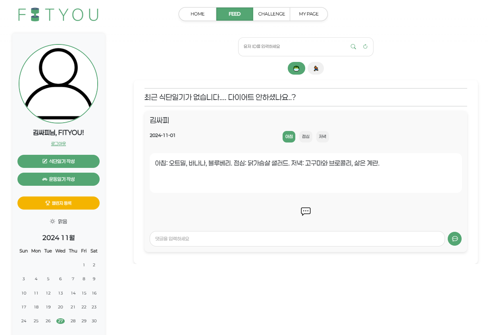
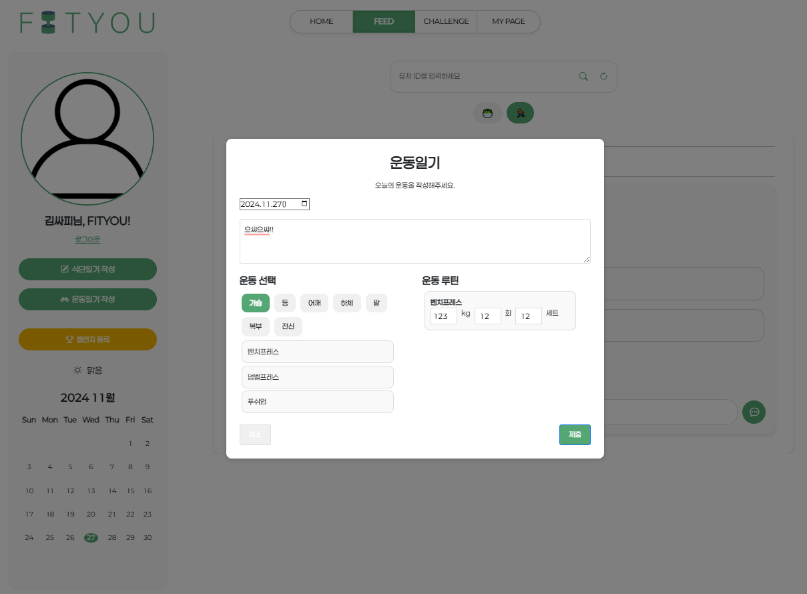

# FIT-YOU !
[ 운동 및 식단 관리 플랫폼 ]

## 프로젝트 개요

### 기획 배경
- **나는 뭘 먹고 살았더라?**  
- **지속적인 피드백을 원해!**
- **식단과 운동 기록을 한 번에 관리할 수 있다면..?**
- **나만의 챌린지를 만들어서 친구들과 도전하고 싶어!**
- **운동을 기록하고 공유하며 동기부여를 받을 수 있는 플랫폼!**

### 목표
- 운동 및 식단 기록을 관리하고 타인과 공유할 수 있는 **SNS 형태의 웹사이트**를 구축합니다.
- **챌린지 기능**을 통해 사용자들에게 동기부여를 제공합니다.

---

## 주요 기능

### 1. **기록 시스템**
- 사용자들이 **운동**과 **식단** 활동을 기록 및 조회할 수 있는 기능을 제공합니다.
- 특정 날짜별 기록 조회 및 팔로우한 사용자들의 기록도 확인 가능합니다.

### 2. **팔로우 시스템**
- 사용자는 관심 있는 다른 사용자들을 팔로우하고, 해당 사용자들의 활동을 피드에서 확인할 수 있습니다.
- **유사 관심사**를 가진 사용자를 추천해줍니다.

### 3. **챌린지 시스템**
- 사용자가 목표를 설정하고 이를 기반으로 챌린지를 생성할 수 있습니다.
- 다른 사용자들과 챌린지를 공유하고 함께 도전할 수 있습니다.

### 4. **날씨 API**
- 날씨 API를 활용하여 서울 기준 현재 날씨 정보를 제공합니다.

---

## 개발 진행 계획
| 날짜        | 작업 내용                              |
|-------------|---------------------------------------|
| 11월 19일   | 아이디어 회의 및 Mockup 파일 작성      |
| 11월 20일   | 백엔드 작업 시작, 프론트엔드 화면 구성 및 테스트 |
| 11월 21일   | 백엔드 작업 완료 및 프론트-백엔드 통신 확인 |
| 11월 22-25일| 프론트엔드 화면 구성, 테스트 및 디버그, 최종 개선 |
| 11월 26일   | 테스트 및 디버그 완료, 발표 자료 작성 |

---

## 시스템 설계

### 1. 주요 서비스 및 메뉴
- **Login:** 로그인/회원가입/로그아웃
- **User:** 마이페이지 확인 및 정보 수정
- **Diet:** 식단 일기 등록 및 조회
- **Workout:** 운동 일기 등록 및 조회
- **Follow:** 사용자 팔로우 및 언팔로우
- **Challenge:** 챌린지 생성, 참여 및 조회
- **Comment:** 댓글 등록 및 조회
- **Recommend:** 유사 관심사를 가진 사용자 추천
- **Weather API:** 현재 서울 날씨 정보 제공

### 2. 데이터베이스 ERD
- User, Workout, Diet, Follow, Challenge, Comment 등 주요 테이블 구조를 설계하여 데이터 관리.

---

## 기대 효과
- **운동 습관 지속성 향상:** 운동 기록 및 피드백을 통해 사용자가 꾸준히 운동하도록 도움.
- **소셜 기능:** 팔로우 및 챌린지 기능을 통한 사용자 간 상호작용 강화.
- **효율적인 기록 관리:** 운동과 식단 기록을 한 곳에서 관리 가능.
- **건강한 커뮤니티 형성:** 운동 목표 및 관심사를 공유하는 커뮤니티 조성.

---

## 개발 후기
- **어려웠던 점:** 사용자 맞춤 추천 알고리즘 설계.
- **배운 점:** 사용자 경험(UX)을 고려한 설계의 중요성.
- **향후 개선점:** 
  - 더 다양한 운동 카테고리 추가.
  - 챌린지 기능 다양화.
  - 추천 알고리즘 고도화.

---

## 주요 화면
- **Login 페이지**: 사용자 로그인 및 회원가입
- 로그인

- 홈

- **Feed 페이지**: 팔로우한 사용자의 운동/식단 기록 확인

- **Challenge 페이지**: 챌린지 목록 및 참여 화면

- **Weather API**: 현재 날씨 정보 제공

---

## 개발 환경
- **백엔드:** Spring Framework
- **프론트엔드:** Vue.js
- **데이터베이스:** MySQL
- **버전 관리:** GitHub

---